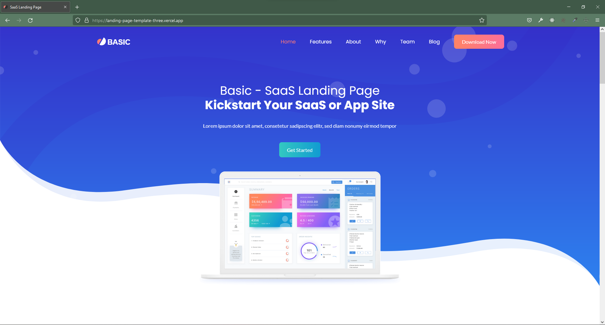

# Basic Landing Page

This open source project aims to provide a basic landing page.

<h2 align="center">
  <a href="https://landing-page-template-three.vercel.app/" target="_blank">Basic Landing Page</a>
</h2>

<p align="center">
  Sample Desktop Application 👇
</p>

<p align="center">

</p>

## Built With

This project was built using these technologies.

- JavaScript
- HTML
- CSS
- BootStrap
- Particles.js
- Deployed on Vercel

## Features are:

- Added a Navbar.
- Added Footer.
- Animation.

### 🛠 Installation and Setup Instructions

To get started just clone this repository.

Run

```
using Live server or open in any web browser
```

Open with your browser to see the result and change according to your configuration.

### Show your support

📌 Please feel free to contribute to this project with your commits, and share this with your friends if you like this projects.😁 😃

Give a ⭐ if you like this website! Fork it and contribute

# Can I contribute?

Sure, open an issue, point out errors, and what not. Wanna fix something yourselves, you're welcome to open a PR and I appreciate it.
